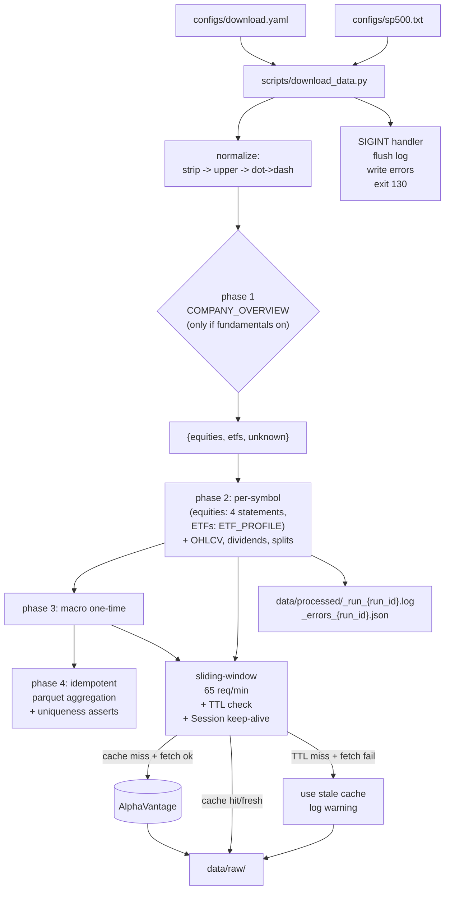

# AlphaVantage Bulk Data Download Pipeline

Process for downloading OHLCV, fundamentals, and macro data from AlphaVantage for data analysis. Designed for the **$49.99/month Premium 75** plan (75 requests/minute, no daily cap).

## Goal

Download analysis-ready market data for up to 500 symbols, respecting the 75 req/min cap, in a way that is **resumable**, **freshness-aware** (per-endpoint TTL), **partial-failure-tolerant** (per-symbol error isolation; stale-cache fallback), **interrupt-safe** (atomic writes; graceful SIGINT), and produces Parquet files keyed for analysis.

## Rate-limit context

- Plan: **75 req/min, no daily limit, 15-min delayed US data, all premium endpoints**.
- The existing client in [`src/stock_transformer/data.py`](../src/stock_transformer/data.py) throttles at 12s between calls (5 req/min).
- Replacement: **sliding-window limiter at 65 req/min** (15% safety margin under 75).

## Scope

Standalone bulk-download path. Does not modify the existing training code ([`run.py`](../run.py), [`features.py`](../src/stock_transformer/features.py), [`model.py`](../src/stock_transformer/model.py), [`train.py`](../src/stock_transformer/train.py)) or `configs/default.yaml`.

## Kitchen sink — what's in vs. out

**In** (per-symbol):

- `TIME_SERIES_DAILY_ADJUSTED` (1) — OHLCV + adj close + split/div coefficients
- `COMPANY_OVERVIEW` (1) — sector, industry, market cap, P/E, **AssetType** for routing
- For **equities**: `INCOME_STATEMENT`, `BALANCE_SHEET`, `CASH_FLOW`, `EARNINGS` (4)
- For **ETFs**: `ETF_PROFILE` (1)
- `DIVIDENDS`, `SPLITS` (2)

**In** (one-time macro, ~20 calls total):

- `REAL_GDP`, `REAL_GDP_PER_CAPITA`, `INFLATION`, `RETAIL_SALES`, `DURABLES`, `UNEMPLOYMENT`, `NONFARM_PAYROLL`
- `CPI` (interval=monthly), `FEDERAL_FUNDS_RATE` (interval=daily)
- `TREASURY_YIELD` × 6 maturities (3month / 2year / 5year / 7year / 10year / 30year, daily)

**Out** (deliberately excluded):

- Technical indicators (derive locally from OHLCV)
- `HISTORICAL_OPTIONS` (3M+ calls; infeasible)
- `NEWS_SENTIMENT` (paginated; separate windowed-crawl design needed)
- `INSIDER_TRANSACTIONS`, `INSTITUTIONAL_HOLDINGS`, `EARNINGS_CALL_TRANSCRIPT` (phase 2)
- `ANALYTICS_FIXED_WINDOW` / `ANALYTICS_SLIDING_WINDOW` (derive locally)
- All realtime / intraday endpoints

## Architecture



## Components

### 1. Hardened `AlphaVantageClient` ([`src/stock_transformer/data.py`](../src/stock_transformer/data.py))

- **`requests.Session`** — single session reused across all calls (HTTP keep-alive saves time over 3,700 cold calls).
- **Sliding-window rate limiter** — `deque[float]` over the last 60s; sleeps until `len < rpm`. Default `rpm=65`. Injectable `clock` and `sleeper` for fast-forward testing.
- **Atomic cache writes** — write to `*.tmp`, then `os.replace`. Same directory, so atomic on every supported platform.
- **`*.tmp` cleanup at startup** — walk `data/raw/` once on client init and unlink any leftover `*.tmp` from a previous SIGKILL.
- **Cache slug excludes `apikey`** — strip the API key before hashing. Today the slug includes it, so rotating keys silently invalidates the entire cache.
- **Broader rate-limit detection** — match (case-insensitive) `"requests per minute"`, `"api rate limit"`, `"premium membership"`, plus any `"Information"` payload mentioning rate or quota.
- **Transient-error retries** — exponential backoff on `ConnectionError`, `Timeout`, `HTTPError` (5xx). Distinct from rate-limit retries.
- **Per-endpoint TTL** — `query(function, params, max_age_sec=None)`. If `mtime <= now - max_age_sec` → refetch. `None` = permanent cache.
- **Stale-cache fallback** — if a TTL refetch fails (network, AV error other than rate-limit), and a cached file exists, **return the stale cache and emit a `WARNING`**. Configurable via `stale_fallback: true|false` in YAML. Increments `stale_fallbacks` in the run summary.
- **CSV support** — `query_csv(...)` for endpoints like `LISTING_STATUS`. Cached as `.csv`.
- **Force `datatype=json`** at every JSON call site (AV defaults to CSV for `DIVIDENDS`, `SPLITS`, `TREASURY_YIELD`, etc.).

Recommended TTLs (overridable in `configs/download.yaml::cache_ttl`):

| Endpoint family | TTL |
|---|---|
| OHLCV (`TIME_SERIES_DAILY_ADJUSTED`) | 24h |
| `COMPANY_OVERVIEW` | 7d |
| Fundamentals (income / balance / cashflow / earnings) | 30d |
| `ETF_PROFILE` | 30d |
| `DIVIDENDS`, `SPLITS` | 7d |
| Macro | 24h |

### 2. Parsers ([`src/stock_transformer/av_parsers.py`](../src/stock_transformer/av_parsers.py), new)

Pure functions, one per endpoint family. **Important**: AlphaVantage returns fundamentals as strings — including the literal string `"None"` for nulls. Every numeric field must be coerced via `pd.to_numeric(..., errors="coerce")` to avoid `object` dtype in Parquet.

- `parse_company_overview(payload, symbol) -> DataFrame` — empty DataFrame for `payload == {}`.
- `parse_financial_statement(payload, symbol, kind)` — concatenates annual + quarterly, columns: `symbol`, `fiscalDateEnding` (datetime), `frequency`, `reportedCurrency`, all numerics coerced.
- `parse_earnings(payload, symbol)` — annual + quarterly. Annual rows have NaN for surprise fields (expected).
- `parse_etf_profile(payload, symbol) -> (overview_row, holdings_rows)`.
- `parse_dividends`, `parse_splits`.
- `parse_macro(payload, series_name)` — generic for AV's `{"data": [{"date","value"}, ...]}` shape.
- `detect_asset_type(payload) -> {"Common Stock","ETF","Unknown"}` — drives phase 1 routing.

### 3. Orchestration ([`src/stock_transformer/av_download.py`](../src/stock_transformer/av_download.py), new)

```python
@dataclass(frozen=True)
class DownloadSummary:
    run_id: str                # UTC timestamp, e.g. "20260425T193500Z"
    elapsed_sec: float
    calls_made: int            # cache misses that succeeded
    cache_hits: int            # cache reads (TTL-fresh)
    stale_fallbacks: int       # TTL miss + fetch fail -> served stale
    errors: int                # per-symbol errors logged
    output_paths: list[Path]   # parquet files written

def run_download(
    config_path: str,
    dry_run: bool = False,
    retry_errors: bool = False,
    no_cache: bool = False,
    symbols_override: list[str] | None = None,
) -> DownloadSummary:
    ...
```

**Phase 0 — load and normalize.** Read manifest; load symbols; normalize each: `strip → upper → "." → "-"` (so `BRK.B` → `BRK-B`). Drop blank lines and `#` comments.

**Phase 1 — classifier (only if fundamentals enabled).** Fetch `COMPANY_OVERVIEW` for each symbol. Bucket by `AssetType`. Persist to `data/processed/_universe_split.json`.

**Phase 2 — per-symbol data.** TTL-checked fetches. Equities → 4 statements; ETFs → `ETF_PROFILE`; unknowns → logged + skipped. OHLCV / dividends / splits run for both.

**Phase 3 — macro.** Iterate explicit `(endpoint, params)` list from manifest.

**Phase 4 — parquet aggregation.** **Always rebuilds from current state of `data/raw/`.** Never appends. After write, **assert primary-key uniqueness**:

| File | Primary key |
|---|---|
| `ohlcv.parquet` | `(symbol, date)` |
| `income_statement.parquet`, `balance_sheet.parquet`, `cash_flow.parquet` | `(symbol, fiscalDateEnding, frequency)` |
| `earnings.parquet` | `(symbol, fiscalDateEnding, frequency)` |
| `dividends.parquet` | `(symbol, ex_dividend_date)` |
| `splits.parquet` | `(symbol, effective_date)` |
| `treasury_yield.parquet` | `(maturity, date)` |
| Other macro parquets (`real_gdp.parquet`, `cpi.parquet`, …) | `(date)` |

Violations halt loudly (data integrity bug worth fixing).

**Per-symbol error tolerance.** Each call wrapped in try/except. Errors logged to `data/processed/_errors_{run_id}.json`; `_errors_latest.json` mirrors the latest run. Each entry stores `function`, `symbol` (may be `null` for macro), `error_class`, `error_message`, `timestamp`, and `params` — the exact request payload, so any failure (including macro endpoints like `TREASURY_YIELD` with a specific `maturity`) can be replayed verbatim. `--retry-errors` reads `_errors_latest.json` and replays each entry using its stored params, falling back to symbol-based defaults for older logs that pre-date the `params` field. The synthetic `RUN`/`KeyboardInterrupt` marker written on SIGINT is skipped during retry.

**Logging.** `logging.getLogger("av_download")` at INFO. Two handlers: stderr (one line per call: `[i/N] symbol endpoint cache_status eta`) and per-run file `data/processed/_run_{run_id}.log`. The `DownloadSummary` is appended to the log at end-of-run.

**Graceful SIGINT.** A `signal.SIGINT` handler in `run_download` flushes the logger, writes the in-progress error log to `_errors_{run_id}.json`, prints a partial summary to stderr, and exits with code `130`. Cache writes are atomic so no partial cache state is possible. Phase 4 is skipped on interrupt — re-run picks up from cache.

### 4. CLI ([`scripts/download_data.py`](../scripts/download_data.py), new)

```python
import argparse
from dotenv import load_dotenv
from stock_transformer.av_download import run_download

def main():
    load_dotenv()
    p = argparse.ArgumentParser()
    p.add_argument("-c", "--config", default="configs/download.yaml")
    p.add_argument("--dry-run", action="store_true",
                   help="Print planned calls and ETA without fetching")
    p.add_argument("--retry-errors", action="store_true",
                   help="Only retry (symbol, endpoint) pairs from _errors_latest.json")
    p.add_argument("--no-cache", action="store_true",
                   help="Force-refresh: bypass TTL, treat all cache as expired")
    p.add_argument("--symbols", default=None,
                   help="Comma-separated symbol override (e.g. AAPL,MSFT)")
    args = p.parse_args()
    summary = run_download(
        args.config,
        dry_run=args.dry_run,
        retry_errors=args.retry_errors,
        no_cache=args.no_cache,
        symbols_override=args.symbols.split(",") if args.symbols else None,
    )
    print(summary)
```

`load_dotenv()` is required because `.env` loading currently lives only in [`run.py`](../run.py:30).

### 5. Manifest ([`configs/download.yaml`](../configs/download.yaml), new)

```yaml
symbols_file: "configs/sp500.txt"
# Or inline:
# symbols: ["AAPL", "MSFT", "GOOGL"]

data_types:
  ohlcv: true
  fundamentals: true     # gates phase 1 (overview + ETF routing)
  dividends: true
  splits: true
  macro: true

output_dir: "data"
requests_per_minute: 65
entitlement: "delayed"   # 15-min delayed (Premium 75 plan tier)
on_error: "skip"         # "skip" or "abort"
stale_fallback: true     # serve stale cache when TTL refetch fails

cache_ttl:
  ohlcv: 86400
  company_overview: 604800
  fundamentals: 2592000
  etf_profile: 2592000
  corporate_actions: 604800
  macro: 86400

macro:
  treasury_yield_maturities: ["3month", "2year", "5year", "7year", "10year", "30year"]
  treasury_yield_interval: "daily"
  fed_funds_interval: "daily"
  cpi_interval: "monthly"
```

### 6. Symbol list ([`configs/sp500.txt`](../configs/sp500.txt), new)

Plain text, one ticker per line. Blank lines and `#` comments allowed. Either dot or dash class-share notation works (loader normalizes).

### 7. Output structure

```
data/
  raw/                                    # 1 file per API call, slug-named (apikey excluded)
    time_series_daily_adjusted/*.json
    company_overview/*.json
    income_statement/*.json
    balance_sheet/*.json
    cash_flow/*.json
    earnings/*.json
    etf_profile/*.json
    dividends/*.json
    splits/*.json
    macro/*.json
  processed/
    ohlcv.parquet                         # long: symbol, date, open, high, low, close, adjusted_close, volume, dividend_amount, split_coefficient
    fundamentals/
      company_overview.parquet
      income_statement.parquet            # long: symbol, fiscalDateEnding, frequency, reportedCurrency, ...
      balance_sheet.parquet
      cash_flow.parquet
      earnings.parquet
      etf_profile.parquet
      etf_holdings.parquet
    corporate_actions/
      dividends.parquet
      splits.parquet
    macro/
      real_gdp.parquet
      real_gdp_per_capita.parquet
      inflation.parquet
      retail_sales.parquet
      durables.parquet
      unemployment.parquet
      nonfarm_payroll.parquet
      cpi.parquet
      federal_funds_rate.parquet
      treasury_yield.parquet              # long: maturity, date, value
    _universe_split.json
    _errors_{run_id}.json
    _errors_latest.json
    _run_{run_id}.log
```

## Tests

`tests/test_av_client.py`:

- `test_slug_stable_across_apikeys`
- `test_atomic_cache_write_no_partial_file`
- `test_startup_cleans_orphan_tmp_files`
- `test_session_reused_across_calls`
- `test_rate_limiter_60s_window` (injected fake clock)
- `test_ttl_boundary_mtime_equals_max_age_is_miss`
- `test_ttl_none_keeps_old_cache_forever`
- `test_stale_fallback_on_refetch_failure`
- `test_transient_5xx_retries_and_succeeds`
- `test_rate_limit_detection_matches_premium_message`

`tests/test_av_parsers.py` (with fixtures in `tests/fixtures/`):

- `test_parse_income_statement_coerces_string_None_to_NaN`
- `test_parse_company_overview_returns_empty_for_empty_payload`
- `test_detect_asset_type_etf_vs_stock`
- `test_parse_macro_treasury_yield_long_format`
- `test_parse_earnings_annual_rows_have_nan_surprise`

`tests/test_av_download.py`:

- `test_config_loader_normalizes_class_shares`
- `test_dry_run_makes_no_api_calls`
- `test_phase4_idempotent_when_rerun_with_same_cache`
- `test_phase4_asserts_primary_key_uniqueness`
- `test_sigint_writes_partial_error_log_and_exits_130`

No test calls the real network.

## Dependencies

Add to [`pyproject.toml`](../pyproject.toml):

```toml
"pyarrow>=15.0",   # required for pandas .to_parquet()

[project.optional-dependencies]
dev = ["pytest>=8.0"]
```

## Estimated download times (500 symbols, 65 req/min, ~80/20 stock/ETF split)

| Scope | API calls | Time (cold) |
|-------|-----------|------|
| OHLCV only | 500 | ~8 min |
| OHLCV + COMPANY_OVERVIEW | 1,000 | ~16 min |
| Above + fundamentals (4 × 400 + 1 × 100) | 2,700 | ~42 min |
| Above + dividends + splits | 3,700 | ~57 min |
| Full kitchen sink + macro | ~3,720 | ~58 min |

Cache hits = 0 calls. Within a TTL window subsequent runs are near-instant. `requests.Session` keep-alive saves an estimated 5-10% on cold runs.

## Usage

```bash
# Estimate calls and time without hitting the API
python scripts/download_data.py --dry-run

# Full run
python scripts/download_data.py -c configs/download.yaml

# Re-fetch only failures from the most recent run
python scripts/download_data.py --retry-errors

# Force-refresh (bypass TTL)
python scripts/download_data.py --no-cache

# Quick subset for testing
python scripts/download_data.py --symbols AAPL,MSFT,GOOGL
```

## Known limitations

- **Survivorship bias**: today's S&P 500 misses tickers historically in the index. Fixing requires `LISTING_STATUS&date=...` walks; out of scope.
- **15-min delayed quotes**: Premium 75 plan tier; daily EOD bars unaffected.
- **No incremental OHLCV fetch**: `outputsize=full` returns ~6,000 days every call; the 24h TTL is how next-day re-runs pick up the new close. True incremental fetch is phase 2.
- **Concurrent runs share the 75/min cap**: don't run two `download_data.py` instances against the same key.
- **Symbol normalization is dot→dash + upper only**: more exotic class-share conventions can be added when first encountered.
- **Stale fallback can mask sustained outages**: if AV is down for hours, you keep serving stale data. The `stale_fallbacks` counter and per-call WARNING log surface it; check the summary before treating data as fresh.
