# Stock Transformer Backtest Plan

## Scope and fixed decisions
- **Prediction target:** next-candle **direction** (`up/down`) based on next close relative to current close.
- **Backtest mode:** **forecast evaluation only** (no position sizing, no PnL simulation yet).
- **Timeframes:** minute, hour, day, month candles (hour mapped to intraday `interval=60min`).
- **Data source:** AlphaVantage via MCP (`TOOL_LIST` -> `TOOL_GET` -> `TOOL_CALL`).
- **Multi-ticker scope:** the model trains on a **universe of tickers** jointly, learning shared patterns across stocks rather than fitting one model per symbol.

## Ticker universe
- Define a configurable **ticker list** (e.g. S&P 500 constituents, a sector basket, or a custom watchlist) stored in `configs/universe.yaml`.
- Support filtering criteria: minimum history length, minimum average volume, and listing status (active only).
- Batch-ingest candle data for the full universe; handle per-ticker gaps gracefully (holidays, halts, delistings).
- Periodically refresh the universe to account for index rebalances and new listings.

## Project scaffold (greenfield)
- Expand [README.md](README.md) with architecture, assumptions, and reproducibility commands.
- Add Python package layout under `src/stock_transformer/`:
  - `data/` for ingestion, normalization, candle alignment, and **multi-ticker universe management**.
  - `features/` for tokenization, sequence windowing, and **cross-sectional feature construction**.
  - `model/` for Transformer classifier with **ticker embeddings and cross-stock attention**.
  - `backtest/` for walk-forward evaluation harness.
  - `configs/` for YAML/JSON experiment configs (including ticker universe definition).
- Add `tests/` for leakage guards, sequence slicing, and walk-forward correctness.

## AlphaVantage MCP data plan
- Discover tool availability once per run with `TOOL_LIST`.
- Pull schemas dynamically with `TOOL_GET` before each concrete data request.
- Use these primary endpoints:
  - `TIME_SERIES_INTRADAY` for minute/hour (`interval` in `1min,5min,15min,30min,60min`, `symbol` required).
  - `TIME_SERIES_DAILY` or `TIME_SERIES_DAILY_ADJUSTED` for daily candles.
  - `TIME_SERIES_MONTHLY` or `TIME_SERIES_MONTHLY_ADJUSTED` for monthly candles.
- **Iterate over the full ticker universe** for each endpoint; respect API rate limits (throttle/retry with exponential backoff).
- Normalize all responses to a canonical candle schema:
  - `timestamp, symbol, timeframe, open, high, low, close, volume`
- Persist raw pulls and normalized outputs separately (raw cache + cleaned parquet/csv), with deterministic file naming per `symbol/timeframe/date-range`.
- Store the combined multi-ticker dataset as a single **partitioned parquet** (partitioned by `timeframe`) for efficient cross-ticker queries.

## Leakage-safe dataset construction
- Build strictly time-ordered sequences per `(symbol, timeframe)`.
- For each prediction index `t`:
  - Input tokens: candles `[t-L+1 ... t]` (lookback `L`).
  - Label token: direction of candle `t+1` close vs candle `t` close.
- Drop any rows where future target is unavailable.
- Ensure splits are chronological only (no random shuffling across time).
- **Cross-ticker alignment:** at each timestamp `t`, gather candles for **all symbols** in the universe. Handle missing candles via masking (not forward-filling from future data).
- **Shared training pool:** sequences from all tickers are pooled into a single training set so the model learns transferable patterns across stocks.

## Walk-forward backtest protocol
- Use rolling-origin evaluation:
  - Train window -> validation window -> test window.
  - Advance origin forward by a fixed step and repeat.
- **Time-based splits are global** (the same calendar cutoffs apply to every ticker), so no ticker's future data leaks into another ticker's training window.
- For each fold:
  - Pool sequences from **all tickers** whose data covers the fold's time range.
  - Fit scaler/normalization on **train only** (fit across the full cross-section, not per-ticker).
  - Train model on train split (all tickers combined).
  - Tune threshold/hyperparams on validation split only.
  - Report frozen metrics on test split.
- Aggregate metrics across folds (mean/std + per-fold breakdown).
- Also report **per-ticker** and **per-sector** breakdowns to surface where the model generalises well vs. poorly.

```mermaid
flowchart LR
  universe[TickerUniverse] --> rawData[AlphaVantageMCPData]
  rawData --> canonicalCandles[CanonicalCandles\nAll Tickers]
  canonicalCandles --> crossAlign[CrossTickerAlignment]
  crossAlign --> seqBuilder[SequenceBuilder\nPooled]
  seqBuilder --> foldGenerator[RollingOriginFolds\nGlobal Time Splits]
  foldGenerator --> modelTrain[TrainOnPastOnly\nAll Tickers]
  modelTrain --> foldEval[PredictNextDirection]
  foldEval --> metricsAgg[AggregateMetrics\nGlobal + PerTicker]
```

## Baseline model and training plan
- Start with a compact Transformer encoder classifier for binary direction output.
- **Ticker embedding:** each symbol gets a learned embedding vector concatenated with its candle features, letting the model condition on stock identity.
- Token features per candle: OHLCV-derived normalized values, log-return, and the ticker embedding.
- Use causal attention mask so token `t` cannot attend to `t+1...`.
- Train on the **pooled multi-ticker dataset** so shared market dynamics (momentum, mean-reversion, volatility clustering) are learned once and transferred across stocks.
- Optional future extension: add a **cross-sectional attention** layer that, at each timestep, lets the model attend across tickers to capture inter-stock relationships (sector rotation, relative strength).
- Baseline comparisons:
  - Naive persistence (`next direction = current direction`).
  - Simple moving-average rule baseline.
  - Per-ticker logistic regression on the same feature set (to quantify how much the Transformer's cross-ticker training adds).

## Evaluation outputs (no trading yet)
- Primary classification metrics: accuracy, precision, recall, F1, ROC-AUC — computed **globally across all tickers**.
- **Per-ticker metrics:** same set broken out by symbol to identify where the model excels or struggles.
- **Per-sector / per-market-cap bucket metrics** (if metadata available) to gauge generalisation breadth.
- Calibration diagnostics: probability histogram + Brier score.
- Time-aware diagnostics: per-timeframe and per-symbol metrics, plus fold drift chart.
- Save predictions with columns: `timestamp, symbol, timeframe, y_true, y_prob, y_pred, fold_id`.

## Guardrails and tests
- Add leakage unit tests:
  - No feature row may reference `t+1` or later.
  - Fold boundaries must enforce `max(train_time) < min(val_time) < min(test_time)`.
  - **Cross-ticker leakage:** verify that no ticker's future candle appears in any other ticker's training window for the same fold.
- Add reproducibility checks:
  - Fixed random seeds.
  - Config snapshot saved with each run.
  - **Universe snapshot:** record the exact ticker list used for each experiment.
- Add data integrity checks:
  - Monotonic timestamps.
  - No duplicated `(symbol, timeframe, timestamp)` keys.
  - **Universe coverage:** warn if any ticker has less than a configurable minimum of history overlap with the training window.

## Milestone sequence
1. **Ticker universe definition** + batch data ingestion + canonical candle store.
2. Cross-ticker aligned sequence/label builder with strict temporal indexing.
3. Walk-forward splitter and fold runner (global time splits across all tickers).
4. Baseline + Transformer classifier (with ticker embeddings) training loop on pooled data.
5. Global + per-ticker metrics/report artifacts and reproducibility packaging.
6. (Next phase) cross-sectional attention layer and inter-stock feature engineering.
7. (Future phase) add trading simulation layer after forecast quality is validated.
