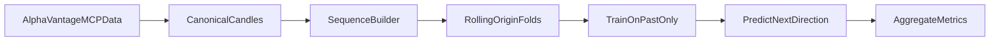

# Stock Transformer Backtest Plan

## Scope and fixed decisions
- **Prediction target:** next-candle **direction** (`up/down`) based on next close relative to current close.
- **Backtest mode:** **forecast evaluation only** (no position sizing, no PnL simulation yet).
- **Timeframes:** minute, hour, day, month candles (hour mapped to intraday `interval=60min`).
- **Data source:** AlphaVantage via MCP (`TOOL_LIST` -> `TOOL_GET` -> `TOOL_CALL`).

## Project scaffold (greenfield)
- Expand [README.md](README.md) with architecture, assumptions, and reproducibility commands.
- Add Python package layout under `src/stock_transformer/`:
  - `data/` for ingestion, normalization, and candle alignment.
  - `features/` for tokenization and sequence windowing.
  - `model/` for autoregressive Transformer classifier.
  - `backtest/` for walk-forward evaluation harness.
  - `configs/` for YAML/JSON experiment configs.
- Add `tests/` for leakage guards, sequence slicing, and walk-forward correctness.

## AlphaVantage MCP data plan
- Discover tool availability once per run with `TOOL_LIST`.
- Pull schemas dynamically with `TOOL_GET` before each concrete data request.
- Use these primary endpoints:
  - `TIME_SERIES_INTRADAY` for minute/hour (`interval` in `1min,5min,15min,30min,60min`, `symbol` required).
  - `TIME_SERIES_DAILY` or `TIME_SERIES_DAILY_ADJUSTED` for daily candles.
  - `TIME_SERIES_MONTHLY` or `TIME_SERIES_MONTHLY_ADJUSTED` for monthly candles.
- Normalize all responses to a canonical candle schema:
  - `timestamp, symbol, timeframe, open, high, low, close, volume`
- Persist raw pulls and normalized outputs separately (raw cache + cleaned parquet/csv), with deterministic file naming per `symbol/timeframe/date-range`.

## Leakage-safe dataset construction
- Build strictly time-ordered sequences per `(symbol, timeframe)`.
- For each prediction index `t`:
  - Input tokens: candles `[t-L+1 ... t]` (lookback `L`).
  - Label token: direction of candle `t+1` close vs candle `t` close.
- Drop any rows where future target is unavailable.
- Ensure splits are chronological only (no random shuffling across time).

## Walk-forward backtest protocol
- Use rolling-origin evaluation:
  - Train window -> validation window -> test window.
  - Advance origin forward by a fixed step and repeat.
- For each fold:
  - Fit scaler/normalization on **train only**.
  - Train model on train split.
  - Tune threshold/hyperparams on validation split only.
  - Report frozen metrics on test split.
- Aggregate metrics across folds (mean/std + per-fold breakdown).

## Baseline model and training plan
- Start with a compact Transformer encoder classifier for binary direction output.
- Token features per candle: OHLCV-derived normalized values (and optional log-return).
- Use causal attention mask so token `t` cannot attend to `t+1...`.
- Baseline comparisons:
  - Naive persistence (`next direction = current direction`).
  - Simple moving-average rule baseline.

## Evaluation outputs (no trading yet)
- Primary classification metrics: accuracy, precision, recall, F1, ROC-AUC.
- Calibration diagnostics: probability histogram + Brier score.
- Time-aware diagnostics: per-timeframe and per-symbol metrics, plus fold drift chart.
- Save predictions with columns: `timestamp, symbol, timeframe, y_true, y_prob, y_pred, fold_id`.

## Guardrails and tests
- Add leakage unit tests:
  - No feature row may reference `t+1` or later.
  - Fold boundaries must enforce `max(train_time) < min(val_time) < min(test_time)`.
- Add reproducibility checks:
  - Fixed random seeds.
  - Config snapshot saved with each run.
- Add data integrity checks:
  - Monotonic timestamps.
  - No duplicated `(symbol, timeframe, timestamp)` keys.

## Milestone sequence
1. Data ingestion + canonical candle store.
2. Sequence/label builder with strict temporal indexing.
3. Walk-forward splitter and fold runner.
4. Baseline + Transformer classifier training loop.
5. Metrics/report artifacts and reproducibility packaging.
6. (Next phase) add trading simulation layer after forecast quality is validated.
