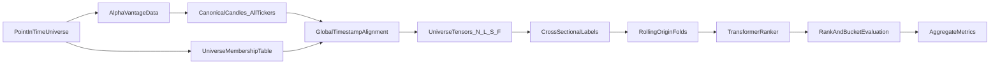

# Stock Transformer Cross-Sectional Backtest Plan

> **Authoritative status lives in [§Milestone tracker](#milestone-tracker).**
> Everything else in this document is the *target design*. When code and plan
> disagree on a completed milestone, code wins and the plan is updated to match.

## Scope and fixed decisions

- **Prediction target:** next-period **cross-sectional ticker performance** over
  a universe. The single-symbol autoregressive head is kept as a reference
  ablation but is no longer the primary path.
- **Primary label (v1):** next-period **relative return** per ticker, demeaned
  by the **nanmedian** of the live cross-section at the same timestamp.
- **Initial prediction task:** score all tickers at time `t` by expected return
  from `t` to `t+1`; report ranking quality.
- **Backtest mode:** forecast evaluation only for v1 — no position sizing or
  PnL simulation.
- **Supported timeframes:** `1min, 5min, 15min, 30min, 60min, daily, weekly,
  monthly`. The `timeframe` field in YAML accepts any of these; it maps to
  Alpha Vantage endpoints via the table in [§Alpha Vantage data plan](#alpha-vantage-data-plan).
- **Data source:** Alpha Vantage REST + on-disk cache. MCP discovery is **out
  of scope until M11** (see [§Milestone tracker](#milestone-tracker)).
- **System design constraint:** the full modeling pipeline is **multi-ticker
  end-to-end**. Inputs, labels, splits, normalization, and metrics are defined
  over the whole universe at each timestamp.
- **End-state:** train on multiple tickers (shared history, aligned timestamps,
  proper masking) and use the model to score or rank performance — including
  the pilot case of a small "predictor" basket informing `MSTR` direction
  (see [§Pilot](#pilot-multi-ticker-inputs-for-mstr-direction)).

## Conventions

Pin these once; every module honours them.

- **Timestamps:** UTC-naive `pd.Timestamp`. Intraday bars are stamped at bar
  close. All panels share a single global index per timeframe.
- **Symbol order:** driven by the YAML `symbols:` list; uppercased at load;
  immutable within a run; snapshot to `universe_membership.json`.
- **Label indexing:** at row `t`, `y[t, s] = close[t+1, s] / close[t, s] - 1`.
  The last row is always NaN. Matches `labels/cross_sectional.py::raw_returns_forward`.
- **Cross-sectional target (`label_mode`):**
  - `raw_return` — no demeaning.
  - `cross_sectional_return` — subtract `nanmedian` across live peers at `t` (v1 default).
  - `equal_weighted_return` *(later)* — subtract nanmean across live peers.
  - `sector_neutral_return` *(later)* — subtract nanmedian within the ticker's sector.
- **Mask polarity:** in feature tensors, `mask[t, s] == True` means
  **padding / invalid** (matches `~row_valid` in `features/universe_tensor.py`).
  Label validity is expressed separately as `torch.isfinite(y)`; loss and
  metrics must combine the two.
- **Coverage rule:** a prediction timestamp `t` is kept iff
  `sum(isfinite(raw_return[t])) >= min_coverage_symbols`. This is evaluated on
  forward return (i.e. both `t` and `t+1` must be finite for that symbol).
  `target_symbol` is **not** required to be live — it is a reporting key only;
  its metrics will be NaN on rows where MSTR is masked.
- **Tensor shapes:**
  - Feature block per sample: `X[n] ∈ [L, S, F]` (L = lookback, S = #symbols).
  - Batched: `X ∈ [N, L, S, F]`, `mask ∈ [N, L, S]`, `y ∈ [N, S]`.
  - F is tracked by `N_UNIVERSE_FEATURES` in `features/universe_tensor.py`;
    will grow when cross-sectional features land (M9) — record `feature_schema_hash`.
- **Deterministic ordering & seeding:** every training run calls
  `torch.manual_seed(cfg.seed)` and `np.random.seed(cfg.seed)`; DataLoaders use
  `torch.Generator` seeded from the same value.
- **Device:** `device: "auto"` prefers MPS on Apple Silicon, else CUDA, else
  CPU. Ops unsupported on MPS fall back to CPU with a single-line warning.

## Objective definition

- At each timestamp `t`, the model observes a lookback window over the entire
  ticker universe and predicts which tickers will outperform / underperform
  over the next horizon.
- Baseline target for ticker `i` at timestamp `t`:
  - `raw_return(i, t) = close(i, t+1) / close(i, t) - 1`
  - `cross_sectional_return(i, t) = raw_return(i, t) - median_j(raw_return(j, t))`
- Prefer a **continuous score target** for ranking, with optional
  bucketization for classification:
  - Regression target: future cross-sectional return (v1).
  - Bucket target: top `q%`, middle bucket, bottom `q%` within the universe at
    timestamp `t` (`labels/cross_sectional.py::bucket_labels_by_quantile`).
- `label_mode` in YAML selects which target variant is used for loss and for
  the primary ranking metric.

## Ticker universe

- Universe defined in `configs/universe.yaml` (v1: fixed watchlist).
- Future sources (M8+): sector basket; point-in-time index membership.
- Filtering criteria (documented here, enforced progressively):
  - Minimum history length.
  - Minimum average volume.
  - Price floor.
  - Listing status at the relevant historical timestamp.
- Survivorship bias guardrails:
  - Do not train only on today's survivors when representing a historical
    benchmark — use the point-in-time membership table from M8.
  - Record the effective universe membership for every fold and timestamp range
    in `universe_membership.json` per run.
- Per-ticker gaps (holidays, halts, late listings, delistings) are handled via
  the mask — never forward-filled.
- `min_coverage_symbols` drops timestamps with insufficient live peers
  (see [§Conventions](#conventions)).

## Project scaffold

```
src/stock_transformer/
├── data/
│   ├── alphavantage.py        # REST client + per-symbol fetch + universe batch
│   ├── canonicalize.py        # AV payload → canonical OHLCV schema
│   ├── cache_paths.py         # raw + canonical cache paths
│   ├── align.py               # outer-join global timestamp alignment
│   ├── universe.py            # UniverseConfig, membership table
│   └── synthetic.py           # seedable fake candles for tests and CI
├── features/
│   ├── sequences.py           # single-symbol multi-timeframe token builder
│   └── universe_tensor.py     # [N, L, S, F] samples + masks
├── labels/
│   └── cross_sectional.py     # raw/relative forward returns, bucket labels
├── model/
│   ├── transformer_classifier.py  # single-symbol CandleTransformer (reference)
│   ├── transformer_ranker.py      # temporal + cross-sectional attention
│   └── baselines.py               # equal score, momentum rank
└── backtest/
    ├── walkforward.py         # fold generation + chronology checks
    ├── metrics.py             # regression + ranking metrics, aggregation
    ├── runner.py              # single-symbol experiment
    └── universe_runner.py     # universe experiment (primary)
configs/
├── default.yaml               # single-symbol reference
└── universe.yaml              # multi-ticker universe (primary)
tests/
├── test_sequences.py
├── test_multitimeframe.py
├── test_walkforward.py
├── test_data_integrity.py
├── test_runner_synthetic.py
├── test_cross_sectional_labels.py
├── test_universe_tensor.py
└── test_universe_runner_synthetic.py
```

## Alpha Vantage data plan

- **REST client (current):** `AlphaVantageClient.query` hits the public REST
  API, caches raw JSON, and emits canonical CSV via `canonicalize_*` helpers.
  Batching over a universe goes through `fetch_candles_for_universe`, which
  respects `min_interval_sec` throttling with retries and exponential backoff.
- **Storage path today:** canonical CSV under `data/canonical/<symbol>/<timeframe>.csv`.
  Good enough through M7. M8 introduces partitioned parquet behind a
  `store: csv|parquet` config flag with read-through compatibility:

  ```
  data/canonical/
    timeframe=daily/symbol=MSTR/part-000.parquet
    timeframe=daily/symbol=IBIT/part-000.parquet
  ```

- **Timeframe → endpoint mapping:**

  | `timeframe` value | AV function | Notes |
  |---|---|---|
  | `1min`, `5min`, `15min`, `30min`, `60min` | `TIME_SERIES_INTRADAY` | `interval` = value verbatim |
  | `daily` | `TIME_SERIES_DAILY` or `_ADJUSTED` (config-driven) | Adjusted = default for equities |
  | `weekly` | `TIME_SERIES_WEEKLY` or `_ADJUSTED` | |
  | `monthly` | `TIME_SERIES_MONTHLY` or `_ADJUSTED` | |

- **Canonical candle schema** (both REST and any future MCP path):
  `timestamp, symbol, timeframe, open, high, low, close, volume`.
- **Raw vs canonical:** raw payloads cached as received for replay; canonical
  outputs written as typed CSV (parquet in M8).
- **Rate limits:** honour `min_interval_sec`; a run fetching 4 symbols × 1
  timeframe should stay well under 5 calls/minute. Tests never hit the network
  (see [§Runtime baseline](#runtime-baseline)).
- **Universe-membership table (M8):** `timestamp_start, timestamp_end, symbol,
  active_flag, sector, market_cap_bucket` — supports point-in-time filtering
  and sector-neutral evaluation. v1 stub in `data/universe.py::membership_table_from_panel`.

## Leakage-safe dataset construction

- Build data on a **global timestamp index** per timeframe, not as isolated
  per-symbol samples.
- For each timestamp `t`:
  - Gather the full universe cross-section of tickers eligible at `t`.
  - Build a lookback tensor covering `[t-L+1 … t]` for all eligible symbols.
  - Predict each symbol's outcome from `t` to `t+1`.
- Core training object per sample:
  - `X_t ∈ [L, S, F]`
  - `mask_t ∈ [L, S]` bool — `True` means padded / invalid.
  - `y_t ∈ [S]` next-period cross-sectional return (or raw, per `label_mode`).
- Never forward-fill future information.
- Mask handles missing candles — only using information available up to `t`.
- Enforce `min_coverage_symbols` at each `t` (see [§Conventions](#conventions)).
- Build labels *after* the timestamp universe at `t` is fixed, so the ranking
  target is computed against the correct contemporaneous peer set.
- Symbol order deterministic per [§Conventions](#conventions).

## Feature construction

- **Per-ticker temporal features (implemented, v1):** OHLC log-returns vs
  previous close, `log1p(volume)`. `N_UNIVERSE_FEATURES = 5`.
- **Planned additional temporal features (M9):**
  - Realized log-return families at multiple horizons.
  - Rolling volatility.
  - Intraperiod range.
  - Volume change.
- **Cross-sectional features (M9):** at each timestamp, per symbol —
  percentile rank of return / volume / volatility within the live universe;
  z-score vs the cross-section; relative strength vs equal-weighted universe;
  relative volume vs median.
- **Static / slow metadata features (M9, when sector source lands):** sector,
  industry, market-cap bucket.
- **Ticker embedding:** included as one feature family; must not be the only
  per-ticker identity signal so the model cannot reduce to
  "single-ticker OHLCV + ticker ID".
- Every feature schema change bumps `feature_schema_hash` in
  `feature_schema.json` (see [§Per-run artifacts](#per-run-artifacts)).

## Walk-forward backtest protocol

- Rolling-origin evaluation: `train → val → test`, advance by a fixed step,
  repeat. Driven by `WalkForwardConfig(train_bars, val_bars, test_bars, step_bars)`.
- Splits are **global in time**: same calendar cutoffs for every ticker.
- Universe membership inside each fold is determined using information
  available at that fold's timestamps only.
- For each fold:
  - Build train/val/test tensors from all eligible timestamps and symbols.
  - Fit scaling / normalization on the **training cross-section only** (M9).
  - Train the model to score the full universe at each timestamp.
  - Tune thresholds / hyperparameters on validation only.
  - Freeze parameters and report test metrics.
- Aggregate metrics across folds with mean / std and per-fold breakdowns.
- Also report:
  - Per-ticker breakdowns.
  - Per-sector breakdowns (M9).
  - Metrics by universe size and coverage level.



## Model and training plan

- v1 architecture (`model/transformer_ranker.py`):
  - Per-symbol **temporal encoder** (causal Transformer) over the lookback window.
  - **Cross-sectional attention** block over symbol representations at `t`.
  - Prediction head: one score per ticker.
- Causal masking over time ensures information from `t+1` never leaks into the
  representation at `t`.
- Symbol masks ensure absent tickers do not contaminate attention or loss.
- **v1 loss:** masked MSE on the cross-sectional target (`label_mode` selects
  the target variant). Listwise / pairwise ranking losses are an explicit
  ablation in M10 under `loss: mse|listwise`.
- Ablation ladder (kept for comparability):
  - Temporal-only per symbol (single-asset head).
  - Temporal + ticker embedding.
  - Temporal + full cross-sectional attention (v1 primary).

## Baselines

- **Equal-score** — no relative edge (implemented: `model/baselines.py::equal_score_baseline`).
- **Momentum rank** — rank by recent trailing return (implemented: `momentum_rank_scores`).
- **Mean-reversion rank** — rank by negative trailing return (M6b).
- **Linear cross-sectional** — OLS / ridge on engineered cross-sectional features (M6b).
- **Gradient-boosted tree ranker** — flat tabular baseline on per-ticker +
  cross-sectional features (M6b).

## Evaluation outputs (forecasting only)

- **Primary ranking metrics** (per timestamp, averaged across folds):
  - Spearman rank correlation of predicted scores vs realized next-period returns.
  - Kendall rank correlation.
  - Top-k hit rate.
  - Precision@k / Recall@k for top-bucket prediction.
  - NDCG@k.
- **Secondary metrics:**
  - Bucket classification accuracy (when bucket labels are used).
  - Regression MAE / RMSE for relative return.
  - Calibration diagnostics if scores are converted to probabilities.
- **Diagnostic breakdowns:**
  - Per-ticker.
  - Per-sector (M9).
  - Per-timeframe.
  - Per-fold.
  - By market regime (future).
- **Predictions table (`predictions_universe.csv`), long format:**
  columns `timestamp, symbol, timeframe, y_true_raw_return,
  y_true_relative_return, y_score, y_rank_pred, y_rank_true, fold_id`.
  *(The current runner writes a wide variant; M7 includes a migration to the
  long schema with a regression test comparing both layouts.)*

## Guardrails and tests

- **Reproducibility checks:**
  - Fixed random seeds.
  - Config snapshot saved with each run.
  - Universe snapshot saved for each fold.
  - Feature schema hash saved with each run.
- **Data integrity checks:**
  - Monotonic timestamps per symbol and on the aligned panel.
  - No duplicated `(symbol, timeframe, timestamp)` keys.
  - Cross-sectional label distributions are sensible (finite mean, bounded variance).
  - Universe coverage and live-symbol count reported for every fold.

### Leakage test matrix

All live in `tests/test_leakage_universe.py` (M7). Each test uses synthetic
data and seeds from `configs/universe.yaml` so no network calls are needed.

| Test | Assertion |
|---|---|
| `test_features_do_not_reference_future` | Scramble panel rows `> t`; rebuild samples; `X` is bitwise identical. |
| `test_label_uses_only_t_to_tplus1` | Perturb `close[t+2]`; `y[t]` unchanged. |
| `test_fold_boundaries_monotonic` | For every fold: `max(ts[train]) < min(ts[val]) < min(ts[test])`. |
| `test_pit_universe_membership` | Symbol listed only from `t=100`; all samples with `t<100` have `mask[:, :, sym] == True`. |
| `test_coverage_drop` | Force `live.sum() < min_coverage_symbols` for a row; that row is absent from samples. |
| `test_deterministic_symbol_order` | Shuffle YAML `symbols`; after re-sorting outputs, results identical. |
| `test_train_scaling_fit_on_train_only` | (M9) Scaler statistics depend only on the train slice. |
| `test_target_symbol_not_required_live` | Row where only MSTR is masked survives; MSTR metrics are NaN, peers are finite. |

## CLI contract

- Entrypoint: `stx-backtest [-c CONFIG] [--synthetic]`.
- Dispatch by `experiment_mode` in YAML:
  - `"single_symbol"` (or absent) → `backtest/runner.py::run_from_config_path`.
  - `"universe"` → `backtest/universe_runner.py::run_universe_from_config_path`.
- Exit code `0` on success, `1` on missing config, `2` on a failing fold.
  `summary.json` is always written, even on partial failure.
- `--synthetic` forces the synthetic data path for both modes (CI / smoke test).

## Runtime baseline

- Python ≥ 3.11.
- PyTorch ≥ 2.2, numpy ≥ 1.26, pandas ≥ 2.2, pyyaml ≥ 6.
- M6b adds scikit-learn ≥ 1.4 and lightgbm ≥ 4.3 (pinned in `pyproject.toml`).
- M8 adds pyarrow ≥ 15.
- Apple Silicon: `device: "auto"` prefers MPS; ops unsupported on MPS fall
  back to CPU with a single-line warning at model build time.
- **No network calls in tests.** Live Alpha Vantage requests are gated behind
  `ALPHAVANTAGE_API_KEY` and a non-`--synthetic` config.

## Per-run artifacts

Every run writes to `artifacts/universe_run_<UTC-timestamp>/`:

| File | Contents |
|---|---|
| `config_snapshot.yaml` | Fully merged effective config (defaults + overrides). |
| `universe_membership.json` | Per-symbol first/last valid row on the aligned panel. |
| `feature_schema.json` | Feature names, `N_UNIVERSE_FEATURES`, git SHA, `feature_schema_hash`. |
| `folds.json` | `fold_id → {train, val, test}` timestamp ranges and sample indices. |
| `summary.json` | Aggregate + per-fold metrics, aggregate baselines, run metadata. |
| `predictions_universe.csv` | Long-format predictions (see [§Evaluation outputs](#evaluation-outputs-forecasting-only)). |
| `model_state_fold_<id>.pt` | Optional; off by default, enable via `save_models: true`. |

## Milestone tracker

> This is the authoritative status. Tick boxes as milestones land.
> Each open milestone has explicit **Definition of Done (DoD)**: artifacts to
> ship, commands that must succeed, and tests that must pass.

- [x] **M1 — Universe config + point-in-time stub.** `configs/universe.yaml`,
      `data/universe.py::UniverseConfig`, `membership_table_from_panel`.
- [x] **M2 — Batch ingest + global alignment.** `fetch_candles_for_universe`,
      `data/align.py::align_universe_ohlcv`.
- [x] **M3 — Universe tensor assembly.** `features/universe_tensor.py`
      (`[N, L, S, F]` + mask).
- [x] **M4 — Cross-sectional targets.** `labels/cross_sectional.py`
      (median demean + bucket labels).
- [x] **M5 — Walk-forward universe runner.** `backtest/universe_runner.py`,
      extended `backtest/metrics.py` with Spearman / NDCG@k / top-k hit rate.
- [x] **M6a — Simple baselines.** Equal-score + momentum rank in
      `model/baselines.py`, wired into the runner.

---

- [ ] **M6b — Tabular baselines.**
  - Ship: `model/baselines_tabular.py::{fit_linear_cs_ranker, fit_gbt_ranker}`;
    `features/tabular.py::flatten_universe_sample(X, mask) -> (N*S, F_flat)`.
  - Pin deps: scikit-learn ≥ 1.4, lightgbm ≥ 4.3 in `pyproject.toml`.
  - Wire into `universe_runner.py` as `baseline_linear_spearman_mean`,
    `baseline_gbt_spearman_mean` in each fold row and in aggregates.
  - DoD:
    - `pytest tests/test_baselines_tabular.py -v` passes.
    - `stx-backtest --synthetic -c configs/universe.yaml` prints and persists
      both new baseline columns in `summary.json`.

- [ ] **M7 — Leakage test matrix + predictions schema migration.**
  - Ship: `tests/test_leakage_universe.py` with the full matrix in
    [§Leakage test matrix](#leakage-test-matrix).
  - Migrate `predictions_universe.csv` to the long schema from
    [§Evaluation outputs](#evaluation-outputs-forecasting-only) and add a
    golden-file test.
  - DoD: `pytest -v` passes; `predictions_universe.csv` columns match the
    documented schema; old wide columns removed.

- [ ] **M8 — Partitioned parquet store + richer membership.**
  - Ship: `data/store.py` with a `CandleStore(store="csv"|"parquet")`
    façade; parquet layout under `data/canonical/timeframe=<tf>/symbol=<sym>/`.
  - Extend `membership_table_from_panel` to accept real listings/delistings
    and emit `timestamp_start/end, active_flag, sector, market_cap_bucket`.
  - DoD:
    - Round-trip test: write parquet → read parquet → bitwise-equal panel.
    - `stx-backtest -c configs/universe.yaml` works with `store: parquet`.

- [ ] **M9 — Cross-sectional features + sector-neutral labels.**
  - Ship: `features/cross_sectional.py` (rank, z-score, relative strength,
    relative volume); integrate into `universe_tensor.py` behind a
    `features: [...]` config list. Bump `N_UNIVERSE_FEATURES` accordingly.
  - Ship: `labels/cross_sectional.py` extended with `equal_weighted_return`
    and `sector_neutral_return` modes (latter reads `configs/sector_map.yaml`,
    a static `symbol → sector` mapping bundled with the repo for the pilot).
  - Ship: `StandardScaler`-style fit on train cross-section only; applied at
    inference.
  - DoD:
    - `test_train_scaling_fit_on_train_only` passes.
    - `summary.json` contains `per_sector` block.
    - `feature_schema_hash` changes when the feature list changes.

- [ ] **M10 — Ranking loss ablation.**
  - Ship: `model/losses.py::{masked_mse, listnet_loss, approx_ndcg_loss}` and
    a `loss: mse|listnet|approx_ndcg` config switch in `universe_runner.py`.
  - DoD: `stx-backtest --synthetic` runs for each `loss` value; aggregate
    metrics reported side-by-side in `summary.json["by_loss"]`.

- [ ] **M11 — (Future) Portfolio construction + trading simulation.**
  - Only begin after ranking quality is demonstrably above baselines on at
    least two walk-forward horizons.
  - Scope: top-k long-only and long/short books; transaction-cost stub;
    turnover reporting.

- [ ] **M12 — (Optional) MCP AlphaVantage path.**
  - Parallel branch for schema discovery via `TOOL_LIST` / `TOOL_GET` / `TOOL_CALL`.
  - Canonical candle schema must be identical to the REST path.
  - Gated behind `data_source: rest|mcp` in YAML.

## Pilot: multi-ticker inputs for `MSTR` direction

As a concrete stepping stone toward a full universe ranker, define a
**minimum viable universe**: one **target** symbol (`MSTR`) and **2–3 predictor**
symbols whose returns plausibly lead or co-move with MSTR's Bitcoin-heavy
balance-sheet narrative. At each aligned timestamp, the model sees all symbols'
lookback features (with masks for missing rows) and predicts MSTR's next-period
**direction** and / or **raw or market-relative return**; later, generalize the
same machinery to a larger cross-section.

Note: in v1 the ranker is trained over the **full cross-section** and
`target_symbol` is a reporting / drill-down key only. A dedicated
MSTR-directional head is an ablation under M10, not part of the core pipeline.

**Suggested predictor tickers (verify availability on your Alpha Vantage plan):**

| Symbol | Role |
|--------|------|
| **IBIT** | Spot Bitcoin ETF — tight link to the primary driver of MSTR's asset value narrative. |
| **COIN** | Crypto exchange equity — high beta to crypto cycles and liquidity. |
| **QQQ**  | Nasdaq-100 proxy — tech / risk-on regime that often co-moves with speculative growth names. |

Reasonable alternatives if a symbol is missing or illiquid on your feed:
**GBTC** (Bitcoin trust), **MARA** or **RIOT** (miners, higher idiosyncratic noise).
For v1, prefer **IBIT + COIN** (2 tickers) and add **QQQ** as a third once
alignment and masking are stable.

**Modeling note:** this pilot is the small-universe special case of the
cross-sectional design: `num_symbols` is 3–4, but tensor layout, masking, and
leakage rules match the full plan so scaling the watchlist does not require a
rewrite.
