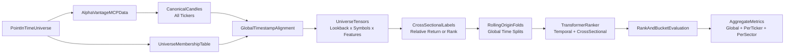

# Stock Transformer Cross-Sectional Backtest Plan

## Current repository vs this plan (living status)

The codebase today is a **working single-symbol, multi-timeframe** pipeline: one `symbol` in YAML (e.g. `IBM` in `configs/default.yaml`), Alpha Vantage ingestion via the **REST client** in `src/stock_transformer/data/alphavantage.py` (with raw + canonical CSV caching), tokenized OHLCV sequences in `src/stock_transformer/features/sequences.py`, a causal `CandleTransformer` that predicts the **next candle** (regression + direction) in `src/stock_transformer/model/transformer_classifier.py`, and walk-forward evaluation in `src/stock_transformer/backtest/runner.py` with per-fold classification/regression metrics in `src/stock_transformer/backtest/metrics.py`.

**Not yet implemented** relative to this document: multi-ticker universe config (`configs/universe.yaml`), partitioned multi-symbol parquet store, global timestamp alignment across symbols, cross-sectional labels (`labels/`), tensor shape `[lookback, num_symbols, features]`, cross-sectional attention / ranker model, ranking metrics (Spearman, NDCG, etc.), and point-in-time universe membership tables. The sections below remain the **target architecture**; milestones should explicitly include refactors that **reuse** canonicalization, throttling, and walk-forward *patterns* from the current code where possible.

**End-state you are driving toward:** train on **multiple tickers** (shared history, aligned timestamps, proper masking) and use that model to score or rank performance—including a practical case where a **small set of liquid “predictor” symbols** informs **MicroStrategy (`MSTR`)** next-period direction or relative return. The cross-sectional universe design is the general case; a **tiny universe** (MSTR + 2–3 inputs) is a valid first multi-ticker milestone before scaling to a broad basket.

## Scope and fixed decisions
- **Prediction target:** next-candle **cross-sectional ticker performance** over a universe, not standalone single-ticker direction. *(Current code: single-ticker next-candle OHLCV + direction; migrate toward relative-return / ranking targets.)*
- **Primary label:** next-period **relative return** for each ticker versus the universe at the same timestamp.
- **Initial prediction task:** rank or score all tickers at time `t` by expected return from `t` to `t+1`.
- **Backtest mode:** forecast evaluation only for now; no position sizing or PnL simulation in v1.
- **Timeframes:** minute, hour, day, month candles (hour mapped to intraday `interval=60min`). *(Current code also supports weekly; monthly is in config—align naming with AV endpoints.)*
- **Data source:** Alpha Vantage. **Implemented:** direct REST API + file cache (see `AlphaVantageClient`). **Optional alignment:** the same endpoints can be driven via MCP (`TOOL_LIST` → `TOOL_GET` → `TOOL_CALL`) for schema discovery in tool-first workflows; the canonical candle schema should stay identical either way.
- **System design constraint:** the full modeling pipeline must be **multi-ticker end-to-end**. Inputs, labels, splits, normalization, and metrics are defined over the whole ticker universe at each timestamp.

## Objective definition
- At each timestamp `t`, the model observes a lookback window over the **entire ticker universe** and predicts which tickers are likely to outperform or underperform over the next horizon.
- Baseline target for ticker `i` at timestamp `t`:
  - `raw_return(i, t) = close(i, t+1) / close(i, t) - 1`
  - `cross_sectional_return(i, t) = raw_return(i, t) - median_j(raw_return(j, t))`
- Prefer a **continuous score target** for ranking, with optional bucketization for classification:
  - Regression target: future cross-sectional return.
  - Bucket target: top `q%`, middle bucket, bottom `q%` within the universe at timestamp `t`.
- Keep the target configurable so experiments can compare:
  - Relative return vs universe median.
  - Relative return vs equal-weighted universe return.
  - Relative return vs sector-neutral peer group, if metadata becomes available.

## Ticker universe
- Define a configurable **universe source** in `configs/universe.yaml`:
  - Fixed custom watchlist.
  - Sector basket.
  - Point-in-time index membership dataset, if available.
- Support filtering criteria:
  - Minimum history length.
  - Minimum average volume.
  - Price floor.
  - Listing status at the relevant historical timestamp.
- Avoid survivorship bias:
  - Do not train only on today's surviving symbols if the universe is meant to represent a historical benchmark.
  - Record the effective universe membership for every fold and timestamp range.
- Handle per-ticker gaps gracefully:
  - Holidays.
  - Halts.
  - Late listings.
  - Delistings.
- Define a configurable **coverage threshold** for each timestamp so the model only trains on cross-sections with enough live tickers present.

## Project scaffold (greenfield vs implemented)
- Expand [README.md](README.md) with architecture, assumptions, data limitations, and reproducibility commands. *(README still describes the single-symbol multi-timeframe autoregressive model; update when multi-ticker lands.)*
- Python package layout under `src/stock_transformer/`:
  - `data/` — **partially done:** ingestion, canonicalization, caching; **to add:** universe membership, multi-symbol batch fetch orchestration, global timestamp alignment outputs.
  - `features/` — **done for one symbol:** multi-timeframe tokens; **to add:** per-ticker panels, cross-sectional features, universe tensor assembly `[L, S, F]`, symbol masks.
  - `labels/` — **not present:** add relative-return targets, rank/bucket labels.
  - `model/` — **done:** `CandleTransformer` (temporal-only, one stream of tokens); **to add:** ranker/scorer with cross-sectional mixing; keep baselines alongside.
  - `backtest/` — **done:** walk-forward by sample index + single-asset metrics; **to extend:** folds over global time, ranking metrics, per-symbol diagnostics in a universe.
  - `configs/` — **done:** `default.yaml` for single symbol; **to add:** `universe.yaml` (or equivalent section) for ticker lists, coverage thresholds, and target definition.
- `tests/` — **present:** sequences, walk-forward, synthetic runner, data integrity; **to add:** leakage guards, cross-sectional label tests, masking/coverage, rank metrics.

## Alpha Vantage data plan (REST today; MCP optional)
- **Current implementation:** `AlphaVantageClient.query` calls the public REST API, caches raw JSON, and writes canonical CSV via `canonicalize_*` helpers. Batch over symbols by looping `fetch_candles_for_timeframe` (or a thin wrapper), respecting `min_interval_sec` throttling.
- **If using MCP:** discover tool availability once per run with `TOOL_LIST`; pull schemas with `TOOL_GET` before each concrete data request. Keep the same canonical schema as the REST path.
- Use these primary endpoints (both paths):
  - `TIME_SERIES_INTRADAY` for minute/hour (`interval` in `1min,5min,15min,30min,60min`, `symbol` required).
  - `TIME_SERIES_DAILY` or `TIME_SERIES_DAILY_ADJUSTED` for daily candles.
  - `TIME_SERIES_MONTHLY` or `TIME_SERIES_MONTHLY_ADJUSTED` for monthly candles.
- Iterate over the **full ticker universe** for each endpoint and timeframe; respect API rate limits with throttling, retries, and exponential backoff.
- Normalize all responses to a canonical candle schema:
  - `timestamp, symbol, timeframe, open, high, low, close, volume`
- Persist raw pulls and normalized outputs separately:
  - Raw cache by source payload.
  - Cleaned canonical parquet/csv by `symbol/timeframe/date-range`.
- Store the consolidated dataset as **partitioned parquet**:
  - Partition by `timeframe`.
  - Optionally cluster or sort by `timestamp, symbol` for efficient universe-wide reads.
- Maintain an auxiliary universe-membership table:
  - `timestamp_start, timestamp_end, symbol, active_flag, sector, market_cap_bucket`
  - This supports point-in-time filtering and later sector-neutral evaluation.

## Leakage-safe dataset construction
- Build data on a **global timestamp index** per timeframe, not as isolated per-symbol samples.
- For each timestamp `t`:
  - Gather the full universe cross-section of tickers eligible at `t`.
  - Build a lookback tensor covering `[t-L+1 ... t]` for all eligible symbols.
  - Predict each symbol's outcome from `t` to `t+1`.
- Define the core training object as:
  - `X_t`: tensor of shape `[lookback, num_symbols_t, num_features]`
  - `mask_t`: availability mask of shape `[lookback, num_symbols_t]`
  - `y_t`: vector of shape `[num_symbols_t]` containing next-period cross-sectional return or bucket label
- Do not forward-fill future information.
- Allow masking for missing candles, but only from information available up to `t`.
- Enforce a minimum live-symbol count at each timestamp; drop timestamps with insufficient cross-sectional coverage.
- Construct labels only after the timestamp universe at `t` is fixed, so the ranking target is computed against the correct contemporaneous peer set.
- Keep symbol order deterministic within each timestamp snapshot to make tensors reproducible.

## Feature construction
- Per-ticker temporal features for each symbol in the universe:
  - OHLCV-derived normalized values.
  - Log returns.
  - Rolling volatility.
  - Intraperiod range.
  - Volume change.
- Cross-sectional features at each timestamp:
  - Percentile rank of return, volume, and volatility within the live universe.
  - Z-score of each ticker versus the current cross-section.
  - Relative strength versus equal-weighted universe return.
  - Relative volume versus cross-sectional median volume.
- Static or slowly changing metadata features when available:
  - Sector.
  - Industry.
  - Market-cap bucket.
- Include a learned ticker embedding, but only as one feature family inside a larger cross-sectional input. The model must not reduce to "single ticker OHLCV plus ticker ID."

## Walk-forward backtest protocol
- Use rolling-origin evaluation:
  - Train window -> validation window -> test window.
  - Advance origin forward by a fixed step and repeat.
- Splits are **global in time**:
  - The same calendar cutoffs apply to every ticker.
  - Universe membership inside each fold is determined using information available at that fold's timestamps only.
- For each fold:
  - Build train, validation, and test tensors from all eligible timestamps and all eligible symbols in the fold.
  - Fit scaling and normalization on the **training cross-section only**.
  - Train the model to score or rank the entire universe at each timestamp.
  - Tune thresholds or hyperparameters on validation only.
  - Freeze parameters and report test metrics.
- Aggregate metrics across folds with mean/std and per-fold breakdowns.
- Also report:
  - Per-ticker breakdowns.
  - Per-sector breakdowns.
  - Metrics by universe size and coverage level.

## Model and training plan
- Start with a compact Transformer that predicts a **score per ticker** for each timestamp's universe snapshot.
- Required modeling behavior:
  - Temporal encoding across the lookback window.
  - Cross-sectional mixing across symbols available at the same timestamp.
  - Proper masking for missing ticker observations.
- Recommended v1 architecture:
  - Per-symbol temporal encoder over lookback history.
  - Cross-sectional attention block over symbol representations at timestamp `t`.
  - Prediction head that outputs one score per ticker.
- Use causal masking over time so information from `t+1` never leaks into the representation at `t`.
- Use symbol masks so absent tickers do not contaminate attention or ranking loss.
- Train with a target and loss aligned to cross-sectional prediction:
  - Regression loss on relative return.
  - Or pairwise/listwise ranking loss for ordering tickers within each timestamp.
- Keep a simple ablation path:
  - Temporal-only model on each symbol.
  - Temporal + ticker embedding.
  - Temporal + full cross-sectional attention.

## Baselines
- Equal-score baseline:
  - Predict no relative edge across tickers.
- Momentum rank baseline:
  - Rank tickers by recent trailing return.
- Mean-reversion rank baseline:
  - Rank tickers by negative recent trailing return.
- Linear cross-sectional model:
  - Predict next relative return using only engineered cross-sectional features.
- Gradient-boosted tree ranker:
  - Flat tabular baseline on per-ticker plus cross-sectional features.

## Evaluation outputs (forecasting only)
- Primary metrics should reflect **cross-sectional ranking quality**, not only standalone classification:
  - Spearman rank correlation between predicted scores and realized next-period returns per timestamp.
  - Kendall rank correlation.
  - Top-k hit rate.
  - Precision@k / Recall@k for top bucket prediction.
  - NDCG or another ranking-quality metric.
- Secondary metrics:
  - Bucket classification accuracy if bucket labels are used.
  - Regression MAE / RMSE for relative return if continuous labels are used.
  - Calibration diagnostics if scores are converted to probabilities.
- Diagnostic breakdowns:
  - Per-ticker.
  - Per-sector.
  - Per-timeframe.
  - Per-fold.
  - By market regime if later metadata is available.
- Save predictions with columns:
  - `timestamp, symbol, timeframe, y_true_raw_return, y_true_relative_return, y_score, y_rank_pred, y_rank_true, fold_id`

## Guardrails and tests
- Add leakage unit tests:
  - No feature row may reference `t+1` or later.
  - Fold boundaries must enforce `max(train_time) < min(val_time) < min(test_time)`.
  - Cross-sectional targets at timestamp `t` must be computed only from returns realized over `t -> t+1`.
  - Universe membership used at `t` must be point-in-time valid for `t`.
- Add tensor and masking tests:
  - Missing symbols are masked, not silently forward-filled.
  - Symbol ordering is deterministic.
  - Dropped timestamps really fail the minimum-coverage threshold.
- Add reproducibility checks:
  - Fixed random seeds.
  - Config snapshot saved with each run.
  - Universe snapshot saved for each fold.
  - Feature schema hash saved with each run.
- Add data integrity checks:
  - Monotonic timestamps.
  - No duplicated `(symbol, timeframe, timestamp)` keys.
  - Cross-sectional label distributions are sensible.
  - Universe coverage and live-symbol count are reported for every fold.

## Milestone sequence
1. Define the ticker universe and point-in-time membership rules.
2. Batch-ingest candles for all tickers and build the canonical multi-ticker store.
3. Implement global timestamp alignment, masking, and universe tensor generation.
4. Implement cross-sectional target generation for relative return and rank buckets.
5. Build the walk-forward fold runner with global time splits and point-in-time universe filtering.
6. Train baseline ranking models and a Transformer ranker with temporal plus cross-sectional attention.
7. Report ranking metrics, per-ticker diagnostics, and reproducibility artifacts.
8. Future phase: add portfolio construction and trading simulation after forecast quality is validated.

## Pilot: multi-ticker inputs for `MSTR` direction

As a concrete stepping stone toward a full universe ranker, define a **minimum viable universe**: one **target** symbol (`MSTR`) and **2–3 predictor** symbols whose returns plausibly lead or co-move with MSTR’s Bitcoin-heavy balance sheet narrative. At each aligned timestamp, the model sees all symbols’ lookback features (with masks for missing rows) and predicts MSTR’s next-period **direction** and/or **raw or market-relative return**; later, generalize the same machinery to a larger cross-section.

**Suggested predictor tickers (verify availability and adjust for your Alpha Vantage subscription):**

| Symbol | Role |
|--------|------|
| **IBIT** | Spot Bitcoin ETF—tight link to the primary driver of MSTR’s asset value narrative. |
| **COIN** | Crypto exchange equity—high beta to crypto cycles and liquidity. |
| **QQQ** | Nasdaq-100 proxy—tech/risk-on regime that often co-moves with speculative growth names. |

Reasonable alternatives if a symbol is missing or illiquid on your feed: **GBTC** (Bitcoin trust), **MARA** or **RIOT** (miners, higher idiosyncratic noise). For v1, prefer **IBIT + COIN** (2 tickers) and add **QQQ** as a third once alignment and masking are stable.

**Modeling note:** This pilot is the **small-universe special case** of the cross-sectional design: `num_symbols` is 3–4, but tensor layout, masking, and leakage rules match the full plan so scaling the watchlist does not require a rewrite.
